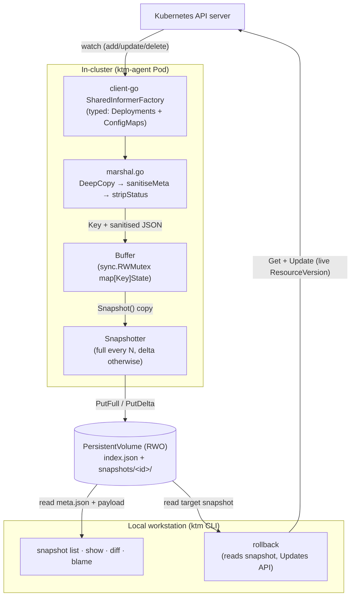

# Architecture

KTM has two binaries and one persistent store. The agent runs in-cluster and records the declarative state of watched resources over time; the CLI runs locally and queries, diffs, and rolls back that recorded state.

## Pipeline



The diagram reflects the code as of Etapa 6:

- The agent uses typed informers (see [ADR-0003](adr/0003-typed-informers.md)); the typed→delta boundary lives in `internal/agent/marshal.go`.
- Every captured object is `DeepCopy`-ed before sanitisation so the informer's shared cache is never mutated.
- The CLI reads snapshots directly from the filesystem (a path the user controls — for MVP that is the agent's PVC mounted locally, or a sync of it). The CLI only talks to the API server during `rollback`.

## What gets recorded

KTM records the **persisted declarative surface** of supported Kubernetes resources: user/tool-owned `metadata` (labels, annotations, name/namespace) plus `spec` or spec-equivalent fields (notably ConfigMap `data` and `binaryData`), after API-server admission/defaulting, **excluding** server-owned metadata (`resourceVersion`, `managedFields`, `generation`) and the top-level `.status` block.

The detailed contract and its consequences are in [ADR-0005](adr/0005-declarative-state-recorder.md). Everything downstream of the marshal boundary operates on this sanitised view.

## Data model

A **Snapshot** is a point-in-time view of the watched resources. Two flavours, taken on a configurable cadence:

- **Full snapshot** — every Key + State observed at this moment. Taken every `snapshot.fullEvery` flushes.
- **Delta snapshot** — the diff from the immediately preceding snapshot: `Added`, `Modified`, `Removed`. Taken every other flush.

A reader reconstructs the state at any point by replaying `apply(full ⨁ delta₁ ⨁ … ⨁ deltaₙ)` along the chain back to the most recent full. Reconstruction cost is bounded by `fullEvery` — the Docker-layer pattern.

Why deltas instead of full snapshots every tick: storage cost grows with **change rate**, not snapshot rate. A 200-resource cluster snapshotted every five minutes for a year is ~57,600 full snapshots; deltas turn that into ~57,600 mostly-empty diff files plus one full per `fullEvery`. The trade-off — more code to get right — is contained in `internal/delta` (100% line coverage + fuzz test). See [ADR-0002](adr/0002-incremental-deltas-with-reference-snapshots.md) for the design.

## On-disk layout

```
<root>/
  index.json
  snapshots/
    <id>/
      meta.json
      full.json     -- iff meta.kind == "full"
      delta.json    -- iff meta.kind == "delta"
```

The per-snapshot directory is self-describing — `meta.json` carries enough metadata (id, kind, timestamp, prevId for deltas) to read the payload on its own. `index.json` is a cache used by the CLI's hot read path (`snapshot list`); the per-snapshot files are the source of truth. The store can be rebuilt by walking the directory tree even if `index.json` is lost. See [ADR-0004](adr/0004-rebuildable-index.md).

The `<id>` is a sortable UTC timestamp at millisecond precision: `20260518T140530123Z`.

## Rollback

`ktm rollback <kind>/<namespace>/<name> --to <id>` is the only write the system performs against the cluster, and it never runs inside the agent — it runs from the user's local CLI under the user's own kubeconfig. The flow:

1. Reconstruct the target snapshot from storage.
2. `Get` the live object from the API server (this also yields the current `ResourceVersion`).
3. Render a preview diff between live and target.
4. Prompt for confirmation.
5. `Update` using the `ResourceVersion` captured in step 2 — no second `Get`.

Step 5 deliberately does not re-fetch after the prompt: a re-fetch would silently absorb any change made between the preview and the apply, undermining the user's informed consent. The full reasoning, including the `Create`-on-404 fallback, is in [ADR-0006](adr/0006-rollback-live-resourceversion.md).

## Out of scope for MVP

- Multi-cluster aggregation.
- Cloud-blob storage drivers (S3 / GCS / Azure Blob).
- Web visor.
- Resource types beyond Deployments and ConfigMaps *as first-class, rollback-capable kinds*. The marshal boundary is designed so adding one is a localised change (one new typed informer + one new `Marshal*` function), but doing it is Phase 2 work. Since v0.1.1 an opt-in dynamic informer (`--watch-resources`) can record arbitrary GVRs for `diff` and `blame`; those kinds are **not** rollback-capable, which still requires a typed path. See [ADR-0003](adr/0003-typed-informers.md).
- Observability of rollout health (Pod conditions, `.status` fields, ReplicaSet hashes). KTM is complementary to Prometheus / kube-state-metrics, not a replacement — see [ADR-0005](adr/0005-declarative-state-recorder.md).

See [docs/roadmap.md](roadmap.md) for the full Phase 2 backlog.

## Related ADRs

- [ADR-0002](adr/0002-incremental-deltas-with-reference-snapshots.md) — incremental deltas + reference snapshots every N.
- [ADR-0003](adr/0003-typed-informers.md) — typed informers over dynamic for MVP.
- [ADR-0004](adr/0004-rebuildable-index.md) — index is a cache, not the source of truth.
- [ADR-0005](adr/0005-declarative-state-recorder.md) — declarative-state recorder, not observed-state.
- [ADR-0006](adr/0006-rollback-live-resourceversion.md) — rollback uses live `ResourceVersion`.
- [ADR-0007](adr/0007-packaging-defaults.md) — distroless, ClusterRole read-only, NetworkPolicy, Recreate strategy.
